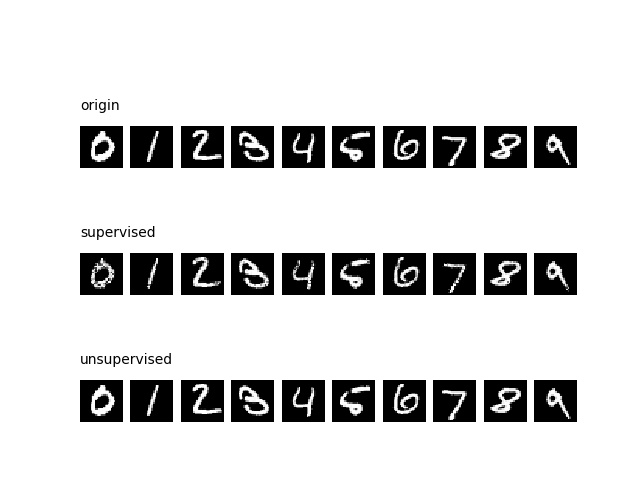

# eForest: A random forest based autoencoder.

This is the official clone for the implementation of encoderForest.(The University's webserver is unstable sometimes, therefore we put the official clone here at github)

Package Official Website: http://lamda.nju.edu.cn/code_eForest.ashx

This package is provided "AS IS" and free for academic usage. You can run it at your own risk. For other purposes, please contact Prof. Zhi-Hua Zhou (zhouzh@lamda.nju.edu.cn).

Description: A python implementation of encoderForest proposed in [1].
A demo implementation of eForest library as well as some demo client scripts to demostrate how to use the code.
The implementation is flexible enough for modifying the model or fit your own datasets.

Reference: [1] J. Feng and Z.-H. Zhou. [AutoEncoder by Forest](http://lamda.nju.edu.cn/fengj/paper/aaai18eForest.pdf). In: Proceedings of the 32nd AAAI Conference on Artificial Intelligence (AAAI'18), New Orleans, Lousiana, USA, 2018].

ATTN: This package was developed and maintained by Mr.Ji Feng(http://lamda.nju.edu.cn/fengj/) .For any problem concerning the codes, please feel free to contact Mr.Feng.（fengj@lamda.nju.edu.cn) or open some issues here.


# Installation
## First step: Create virtual envrionment
The eforest is based on a custom version of scikit-learn, in which we add some extra methods in the origin forest models.\
To avoid confiction with other usage of the official version of scikit-learn, you need to create a seperate envirionment.\
If you are using anaconda ( it's a must), you will need to run the following command.
```
conda create -n eforest python=3.5 anaconda
source activate eforest
pip uninstall scikit-learn
```
## Second step: checkout the scikit-learn codes
The latest released version of sklearn until the code released is v0.19.1, you need to clone the code and check-out that version. That is, run the following command (you cannot install sklearn via pip/conda):
```
git clone https://github.com/scikit-learn/scikit-learn.git
cd scikit-learn
git checkout tags/0.19.1 -b 0.19.1
```
## Third step: Merge eforest code (this repo) into scikit-learn and install it.
Exit the folder and go to the folder containing the package, run the following command.
```
sh copy_codes.sh
cd scikit-learn
python setup.py install
```
And that's it.

# Usage
Current supported model in sklearn includes:
* Supervised Model
    - sklearn.ensemble.RandomForestClassifier
    - sklearn.ensemble.RandomForestRegressor
    - sklearn.ensemble.ExtraTreesClassifier
    - sklearn.ensemble.ExtraTreesRegressor
* Unsupervised Model
    - sklearn.ensemble.RandomTreesEmbedding

## Simple Encode/Decode Demo
```
(x_train, y_train), (x_test, y_test) = mnist.load_data()
x_train = x_train.reshape((x_train.shape[0], -1))
x_test = x_test.reshape((x_test.shape[0], -1))
model = RandomForestClassifier(n_estimators=1000, max_depth=None, n_jobs=-1)
model.fit(x_train, y_train)
X_encode = model.encode(x_test)
X_decode = model.decode(x_test)
```

## Detail API of model.encode
### Parameters
* X [ndarray]
    - shape = [n_samples, n_features]
### Returns
* X_encode [ndarray]
    - shape = [n_samples, n_trees]
    - X_encode[i, j] represent the leaf index for the j'th tree for the i'th sample

## Detail API of model.decode
### Parameters
* X_encode [ndarray]
    - shape = [n_samples, n_trees]
* sample_method [str, default='minimal']
    - If sample_method == 'minimal':
    - The value of each dimension of the decoded result is determined by the minimal value defined by the corresponding MCR, you can define your own sample method as well.
    - MCR (Maximal-Compatible Rule) is the rule defined by the decison paths of X, checkout the paper for more details.
* null_value [float, default=0]
    - The value used to replace nan value when the MCR is not defined for the particular attribute.
### Returns
* X_decode [ndarray]
    - shape = [n_samples, n_feautres]


# More Examples 
## MNIST AutoEncoding Example
The following scripys will display the autoencoding result for MNIST dataset. \
The first row (origin) is the origin images. \
The second row (supervised) is the decoded result of eforest in supervised setting. \
The third row (unsupervised) is the decoded result of eforest in unsupervised setting.
```
python exp/mnist_autoencoder.py
```

## CIFAR10 AutoEncoding Example
Run the following scripts, It will display the autoencoding result for CIFAR10 dataset
```
python exp/cifar10_autoencoder.py
```

